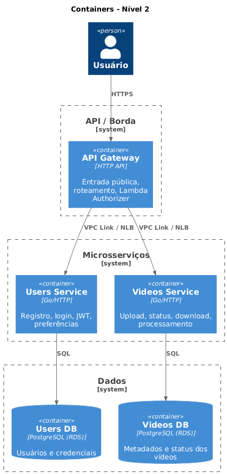

# Documentação da Arquitetura — hack-fiap233

Sistema de processamento de vídeos FIAP X: infraestrutura em AWS com microsserviços (Users, Videos), API Gateway como borda e banco de dados dedicado por serviço.

---

## 1. Visão geral (C4 — Nível 1: Contexto do Sistema)

O **Sistema de Processamento de Vídeos** permite que usuários autenticados enviem vídeos para processamento e baixem o resultado (ZIP de frames). A infraestrutura expõe uma API pública e mantém os serviços e dados em rede privada.

```mermaid
C4Context
    title Contexto do Sistema - Nível 1
    Person(usuario, "Usuário", "Envia vídeos e faz download do ZIP")
    System(sistema, "Sistema de Processamento de Vídeos", "Processa vídeos e entrega resultados")
    usuario --> sistema : usa (HTTPS)
```

| Ator / Sistema | Descrição |
|----------------|-----------|
| **Usuário** | Cliente que se registra, faz login, envia vídeos e consulta status / download. |
| **Sistema de Processamento de Vídeos** | Conjunto de APIs (usuários, vídeos) + processamento assíncrono, persistência e notificações. |

---

## 2. Containers (C4 — Nível 2: Containers)

O sistema é composto por um **API Gateway** (borda), dois **microsserviços** (Users e Videos), bancos de dados dedicados e componentes gerenciados (autorização, mensageria futura).

```mermaid
C4Container
    title Containers - Nível 2
    Person(usuario, "Usuário")
    System_Boundary(api, "API / Borda") {
        Container(apigw, "API Gateway", "HTTP API", "Entrada pública, roteamento, Lambda Authorizer")
    }
    System_Boundary(services, "Microsserviços") {
        Container(users, "Users Service", "Go/HTTP", "Registro, login, JWT, preferências")
        Container(videos, "Videos Service", "Go/HTTP", "Upload, status, download, processamento")
    }
    System_Boundary(data, "Dados") {
        ContainerDb(usersdb, "Users DB", "PostgreSQL (RDS)", "Usuários e credenciais")
        ContainerDb(videosdb, "Videos DB", "PostgreSQL (RDS)", "Metadados e status dos vídeos")
    }
    usuario --> apigw : HTTPS
    apigw --> users : VPC Link / NLB
    apigw --> videos : VPC Link / NLB
    users --> usersdb : SQL
    videos --> videosdb : SQL
```




**Versão PlantUML (C4-PlantUML):**

```plantuml
@startuml Containers-Nivel-2
!include https://raw.githubusercontent.com/plantuml-stdlib/C4-PlantUML/master/C4_Container.puml

title Containers - Nível 2

Person(usuario, "Usuário")

System_Boundary(api, "API / Borda") {
    Container(apigw, "API Gateway", "HTTP API", "Entrada pública, roteamento, Lambda Authorizer")
}

System_Boundary(services, "Microsserviços") {
    Container(users, "Users Service", "Go/HTTP", "Registro, login, JWT, preferências")
    Container(videos, "Videos Service", "Go/HTTP", "Upload, status, download, processamento")
}

System_Boundary(data, "Dados") {
    ContainerDb(usersdb, "Users DB", "PostgreSQL (RDS)", "Usuários e credenciais")
    ContainerDb(videosdb, "Videos DB", "PostgreSQL (RDS)", "Metadados e status dos vídeos")
}

Rel(usuario, apigw, "HTTPS")
Rel(apigw, users, "VPC Link / NLB")
Rel(apigw, videos, "VPC Link / NLB")
Rel(users, usersdb, "SQL")
Rel(videos, videosdb, "SQL")

@enduml
```

| Container | Responsabilidade |
|-----------|------------------|
| **API Gateway** | Único ponto de entrada público; roteamento por path (`/users/*`, `/videos/*`); validação JWT via Lambda Authorizer; repasse de contexto (user_id, email) em headers. |
| **Users Service** | Registro, login, emissão de JWT; listagem/me; (opcional) preferências de notificação. Não valida JWT nas rotas protegidas — usa header `X-User-Id` injetado pelo API Gateway. |
| **Videos Service** | Upload de vídeo, listagem de status por usuário, download do ZIP; (futuro) publicação de eventos de erro para notificação. Usa `X-User-Id` para autorização. |
| **Users DB** | Persistência de usuários (id, name, email, password_hash). |
| **Videos DB** | Persistência de vídeos (id, user_id, status, metadados, paths). |

---

## 3. Diagrama de deploy (infraestrutura AWS)

```
                    Internet
                        │
                        ▼
              ┌─────────────────────┐
              │   API Gateway        │
              │   (HTTP API)         │
              │   + Lambda Authorizer│
              └──────────┬───────────┘
                         │ VPC Link
                         ▼
              ┌─────────────────────┐
              │   NLB (interno)     │
              │   :8081 → Users      │
              │   :8082 → Videos     │
              └──────────┬───────────┘
                         │
         ┌───────────────┼───────────────┐
         ▼               ▼               ▼
   ┌──────────┐   ┌──────────┐   ┌──────────────┐
   │ EKS      │   │ RDS      │   │ RDS          │
   │ Users    │   │ usersdb  │   │ videosdb     │
   │ Videos   │   │ (priv.)  │   │ (priv.)      │
   │ Pods     │   └──────────┘   └──────────────┘
   └──────────┘
```

- **API Gateway**: público; roteia para NLB via VPC Link.
- **NLB**: em subnets privadas; encaminha por porta para os NodePorts do EKS (Users 30081, Videos 30082).
- **EKS**: Pods dos serviços Users e Videos; sem exposição direta à internet.
- **RDS**: duas instâncias PostgreSQL em subnets privadas; credenciais no Secrets Manager.

---

## 4. Fluxo de autorização

1. Cliente envia `Authorization: Bearer <JWT>` para qualquer rota protegida.
2. API Gateway invoca o **Lambda Authorizer** (JWT_SECRET no Secrets Manager).
3. Lambda valida assinatura e expiração; retorna `isAuthorized: true` e `context: { user_id, email }`.
4. API Gateway repassa o contexto aos backends nos headers **`X-User-Id`** e **`X-User-Email`**.
5. Users e Videos leem `X-User-Id`; não precisam do JWT_SECRET nem validar o token.

Decisões relacionadas: [ADR-0002 Lambda Authorizer para JWT](adr/0002-lambda-authorizer-for-jwt.md).

---

## 5. Dados e persistência

- **Database per service**: cada microsserviço possui seu próprio banco (Users DB, Videos DB) para evolução independente e limites de falha.
- **Credenciais**: geradas pelo Terraform (RDS) e armazenadas no **AWS Secrets Manager** (`hack-fiap233/users/db-credentials`, `hack-fiap233/videos/db-credentials`).
- **Schemas**: definidos em scripts versionados em `migrations/` (users e videos); aplicados manualmente ou no primeiro deploy. Ver [Scripts de banco / Migrations](../README.md#scripts-de-banco--migrations) no README da infra.

Decisão relacionada: [ADR-0003 Database per service](adr/0003-database-per-service.md).

---

## 6. Evolução prevista (roadmap)

- **Fase 2**: Mensageria — **RabbitMQ** no EKS (Helm), fila `video.process` e DLQ `video.process.dlq`; credenciais no Secrets Manager; fila de processamento de vídeo e garantia de não perda de requisição. Decisão em [ADR-0004](adr/0004-rabbitmq-for-video-processing-queue.md).
- **Fase 3**: **Redis** (cache) — ElastiCache for Redis (módulo `elasticache`), single node em rede privada; outputs `redis_endpoint`, `redis_port` para os serviços (cache de sessão ou listagem de status).
- **Fase 4**: Notificação do cliente via AWS (SNS + Lambda + SES) em caso de erro de processamento.
- **Fase 5**: **Prometheus + Grafana** — namespace `monitoring`; Prometheus (Helm chart prometheus-community) com descoberta de Pods/Services por anotações, persistência e recursos; Grafana (Helm chart oficial) com datasource Prometheus pré-configurado e credenciais admin em Secret; pasta [monitoring/grafana-dashboards/](../monitoring/grafana-dashboards/) para dashboards como código.
- **Fase 6**: HPA e resiliência (escalabilidade automática dos Pods).

---

## 7. Referências

- [ADR — Architecture Decision Records](adr/README.md)
- [README principal da infra](../README.md) (pré-requisitos, passos, variáveis)
- [ROADMAP do hackathon](../../ROADMAP-HACKATHON-FIAP.md)
